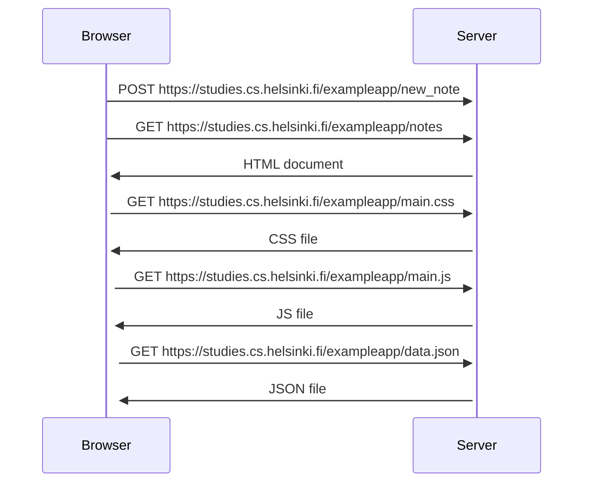

```mermaid
sequenceDiagram;
    Browser->>+Server: POST https://studies.cs.helsinki.fi/exampleapp/new_note
    Browser->>+Server: GET https://studies.cs.helsinki.fi/exampleapp/notes
    Server->>+Browser: HTML document
    Browser->>+Server: GET https://studies.cs.helsinki.fi/exampleapp/main.css
    Server->>+Browser: CSS file
    Browser->>+Server: GET https://studies.cs.helsinki.fi/exampleapp/main.js
    Server->>+Browser: JS file
    Browser->>+Server: GET https://studies.cs.helsinki.fi/exampleapp/data.json
    Server->>+Browser: JSON file
```
